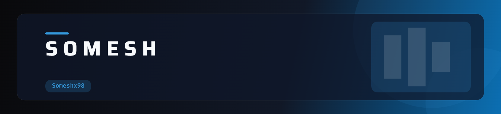

<!-- ========================================================= -->
<!--                    SOMESH PROFILE README                  -->
<!-- ========================================================= -->

<!-- ====================== CUSTOM BANNER ===================== -->

  

<!-- ========================= TITLE =========================== -->

<h1>Hey there, I'm SOMESH 👋</h1>

<a href="https://git.io/typing-svg">
  

  

<!-- ========================= BADGES ========================= -->

  

 

---

<!-- ========================================================= -->
<!--                        ABOUT ME                            -->
<!-- ========================================================= -->

## 🌌 About Me

<table align="center" width="92%">
<tr>

<td width="65%" valign="top">

### 👨‍💻 Who am I?

I'm **Somesh Behera**, a Computer Science & Engineering student who enjoys transforming ideas into practical software and exploring the technologies behind intelligent systems.

- 🎓 **B.Tech CSE Student**
- 💻 Passionate about **Programming & Software Development**
- 🧠 Exploring **Artificial Intelligence & Machine Learning**
- 🤖 Interested in **Generative AI & AI Engineering**
- 📊 Exploring **Data Science & Data Analytics**
- ⚡ Practicing **Data Structures & Algorithms in C++**
- 🌐 Building modern **Web Applications**
- 🛠️ Creating innovative **academic & personal projects**
- 🚀 Constantly experimenting with new technologies
- 🎯 Working toward becoming a strong **AI / Software Engineer**

 

> **"Build it. Break it. Understand it. Build it better."**

</td>

<td width="35%" align="center" valign="middle">

  

 

</td>

</tr>
</table>

 

---

<!-- ========================================================= -->
<!--                       TECH STACK                           -->
<!-- ========================================================= -->

## ⚡ Tech Stack

### 💻 Programming

  

### 🌐 Web Development

  

### 📊 Data Science & Visualization

  

### 🛠️ Tools & Platforms

 

---

<!-- ========================================================= -->
<!--                    GITHUB ANALYTICS                        -->
<!-- ========================================================= -->

## 📊 GitHub Analytics

  

 

---

<!-- ========================================================= -->
<!--                     CONTRIBUTION STREAK                    -->
<!-- ========================================================= -->

## 🔥 Contribution Streak

 

---

<!-- ========================================================= -->
<!--                  CONTRIBUTION CALENDAR                     -->
<!-- ========================================================= -->

## 📈 Contribution Activity

  

 

---

<!-- ========================================================= -->
<!--                    CONTRIBUTION SNAKE                      -->
<!-- ========================================================= -->

## 🐍 Contribution Snake

<!--
==============================================================
IMPORTANT:
The snake is generated by:

.github/workflows/snake.yml

Your repository structure should be:

Someshx98/
│
├── .github/
│   └── workflows/
│       └── snake.yml
│
├── README.md
└── header-dark.png

The GitHub Action should publish the generated SVG files
to the "output" branch.

==============================================================
-->

  

🐍 My contributions are slowly getting eaten.

 

---

<!-- ========================================================= -->
<!--                    CURRENT FOCUS                            -->
<!-- ========================================================= -->

## 🚀 What I'm Currently Exploring

<table width="90%">

<tr>
<td align="center" width="20%">
 
🤖
 
<b>AI</b>
 
Machine Learning Generative AI
  
</td>

<td align="center" width="20%">
 
📊
 
<b>Data Science</b>
 
Python Analytics
  
</td>

<td align="center" width="20%">
 
🧠
 
<b>DSA</b>
 
C++ Problem Solving
  
</td>

<td align="center" width="20%">
 
🌐
 
<b>Development</b>
 
Web Apps REST APIs
  
</td>

<td align="center" width="20%">
 
🛠️
 
<b>Projects</b>
 
Build Experiment
  
</td>

</tr>

</table>

 

---

<!-- ========================================================= -->
<!--                     FEATURED MINDSET                       -->
<!-- ========================================================= -->

## 🏆 Featured Mindset

  

 

---

<!-- ========================================================= -->
<!--                      PROJECT PHILOSOPHY                     -->
<!-- ========================================================= -->

## 💡 My Development Philosophy

<table width="85%">

<tr>
<td align="center">

### 🧠 Learn

Understand the technology before blindly using it.

</td>

<td align="center">

### 🛠️ Build

Turn concepts into working projects.

</td>

<td align="center">

### 🔬 Experiment

Try unusual ideas and discover what works.

</td>

<td align="center">

### 🚀 Improve

Refactor, optimize and keep moving forward.

</td>
</tr>

</table>

 

---

<!-- ========================================================= -->
<!--                        CONNECT                             -->
<!-- ========================================================= -->

## 🤝 Let's Connect

  

---

### 💜 Thanks for stopping by!

Explore my repositories, follow my journey, and let's build something interesting.

  

  

<!-- ======================= FOOTER =========================== -->

